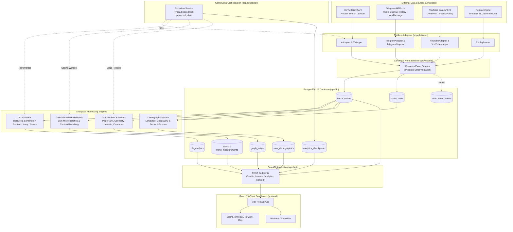
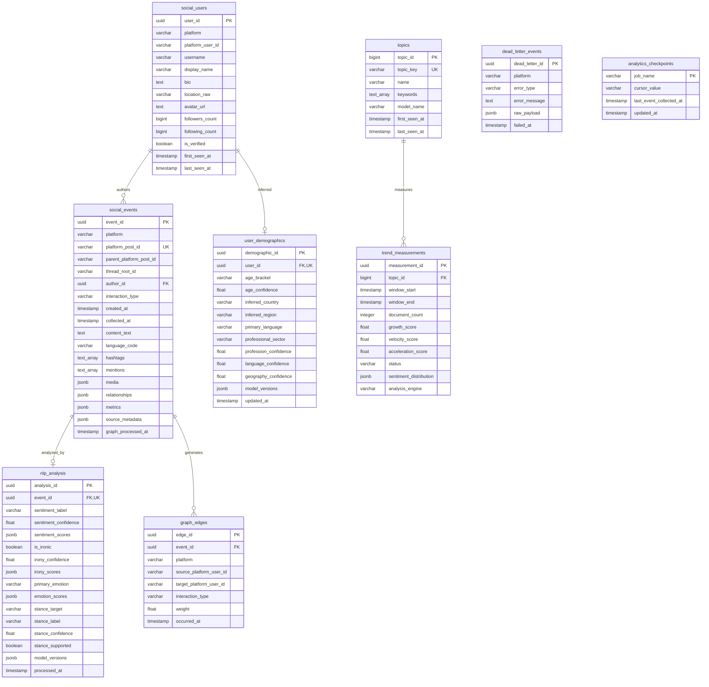

# Social Sentinel: Full System Architecture & Tech Stack

> **Project Name:** Social Sentinel (AI-Driven Social Media Analytics Framework)  
> **Status:** Production-Grade Architecture & Verified Implementation  
> **Target Runtime:** Python 3.13 (CPython 3.13.11) | Node.js 22 (v22.22.0)  
> **Specification Version:** 1.0 (Post-Milestones Audit)  

---

## Table of Contents
1. [Executive Summary & Core Philosophy](#1-executive-summary--core-philosophy)
2. [High-Level Architecture & Layer Boundaries](#2-high-level-architecture--layer-boundaries)
3. [Technology Stack Matrix](#3-technology-stack-matrix)
4. [End-to-End System Diagrams & Data Flow](#4-end-to-end-system-diagrams--data-flow)
5. [Component Architecture Deep-Dive](#5-component-architecture-deep-dive)
   - [5.1 Ingestion & Platform Adapters](#51-ingestion--platform-adapters)
   - [5.2 Canonical Event Normalization](#52-canonical-event-normalization)
   - [5.3 Persistence & Repository Layer](#53-persistence--repository-layer)
   - [5.4 Multi-Dimensional NLP Analytics Engine](#54-multi-dimensional-nlp-analytics-engine)
   - [5.5 Temporal Topic Discovery & Trend Engine (BERTrend)](#55-temporal-topic-discovery--trend-engine-bertrend)
   - [5.6 Network Topology, Graph & Cascade Analytics](#56-network-topology-graph--cascade-analytics)
   - [5.7 Aggregate Demographics Profiling Engine](#57-aggregate-demographics-profiling-engine)
   - [5.8 Continuous Scheduler & Watermark Checkpoints](#58-continuous-scheduler--watermark-checkpoints)
   - [5.9 Application REST API (FastAPI)](#59-application-rest-api-fastapi)
   - [5.10 Web Dashboard & Visual Analytics (React 19 / Vite)](#510-web-dashboard--visual-analytics-react-19--vite)
   - [5.11 Replay Engine & Offline Demo Infrastructure](#511-replay-engine--offline-demo-infrastructure)
6. [Data Model & Database Schema Specification](#6-data-model--database-schema-specification)
7. [Security, Privacy & Operational Governance](#7-security-privacy--operational-governance)
8. [Problem Statement (PS) Requirement Coverage](#8-problem-statement-ps-requirement-coverage)

---

## 1. Executive Summary & Core Philosophy

**Social Sentinel** is an AI-driven, multi-platform social media intelligence and analytics framework. It ingests real-time and historical events across heterogeneous social networks, standardizes disparate payloads into a strictly validated **Canonical Event Model**, durably persists them in chronological order, and executes multi-dimensional analytical pipelines:

1. **How people feel:** Positive/negative/neutral sentiment, fine-grained emotions (with nervousness mapped to anxiety), irony/sarcasm detection, and fixed-target stance inference.
2. **Who the audience is (Aggregated):** Privacy-conscious demographic inference across primary language, geographical distribution, and professional sector affinities.
3. **What topics are emerging:** Dynamic micro-batch topic discovery and cross-window evolution metrics (growth, velocity, acceleration) using **BERTrend**.
4. **How users interact & propagate:** Network topology extraction (mentions, replies, reposts, quotes), PageRank, HITS, betweenness/closeness centrality, Louvain community clustering, and observed cascade tree reconstruction.

### Engineering Tenets
- **Correctness > Polish:** No speculative infrastructure. Heavy distributed message queues (Kafka, Redis, Celery, Kubernetes) are explicitly omitted in favor of robust, idempotent database writes and lightweight in-process thread scheduling.
- **Hexagonal Architecture (Ports & Adapters):** Platform-specific SDK objects (Tweepy, Telethon, Google API Client) are strictly contained within their respective adapters. No external platform object leaks downstream.
- **Strict Data Integrity:** Source timestamps (`created_at`) are preserved in UTC and distinct from ingestion observation times (`collected_at`).
- **Honest Status Reporting:** The system explicitly surfaces status flags (`PASS`, `FAIL`, `SKIPPED`, `UNAVAILABLE`) instead of faking success or synthesising data. Where model support or evidence is insufficient (e.g., age classification or general-target stance), the system formally reports `UNAVAILABLE`.

---

## 2. High-Level Architecture & Layer Boundaries

The platform is designed around strict unidirectional boundaries:

```text
External Social APIs (X, Telegram, YouTube) & Replay Engine
                            │
                            ▼
              [ Platform Adapter Layer ]
  (Translates API objects into Canonical Pydantic Schemas)
                            │
                            ▼
               [ Validation & Normalization ]
             (UUID, UTC timestamps, schema checks)
                            │
                            ▼
                 [ PostgreSQL Persistence ]
   (Idempotent upsert, unique constraints, GIN indexes)
                            │
       ┌────────────────────┼────────────────────┐
       ▼                    ▼                    ▼
[ NLP Service ]    [ BERTrend Engine ]   [ Graph Analytics ]
- RoBERTa Sentiment - Micro-batching      - NetworkX Graphs
- GoEmotions        - SentenceEmbeddings  - Centrality / PageRank
- Irony Classifier  - Centroid Cosine     - Louvain Communities
- Target Stance     - Evolution Metrics   - Cascade Trees
       │                    │                    │
       └────────────────────┼────────────────────┘
                            │
                            ▼
                [ FastAPI REST Interface ]
         (Dependency Injection, Typed API Schemas)
                            │
                            ▼
              [ React 19 Frontend Dashboard ]
   (Vite, TanStack Query, Recharts, Sigma.js WebGL Engine)
```

---

## 3. Technology Stack Matrix

### 3.1 Backend & Runtime Environment
| Component | Technology | Version | Purpose / Architectural Role |
| :--- | :--- | :--- | :--- |
| **Language Runtime** | Python (CPython) | `3.13.11` | Primary language execution environment on ARM64/x86_64. |
| **Package Manager** | `uv` / `hatchling` | `>=0.4` | High-performance dependency resolution and virtualenv management. |
| **Web Framework** | FastAPI | `0.115+` (installed `0.141.1`) | Async HTTP API layer, dependency injection, OpenAPI documentation. |
| **ASGI Server** | Uvicorn (standard) | `0.34+` (installed `0.53.0`) | High-performance ASGI production server. |
| **Validation / Typing**| Pydantic / Settings| `2.10+` (installed `2.13.5`) | Canonical schemas with `extra="forbid"`, strict validation, env config. |

### 3.2 Database & Persistence
| Component | Technology | Version | Purpose / Architectural Role |
| :--- | :--- | :--- | :--- |
| **RDBMS** | PostgreSQL | `16.14` | Chronological event store, relational integrity, JSONB semi-structured data. |
| **Python Driver** | `psycopg` (binary) | `3.2+` (installed `3.3.6`) | Modern Psycopg3 driver supporting native PostgreSQL types and pools. |
| **ORM / Query Engine**| SQLAlchemy | `2.0+` (installed `2.0.54`) | Type-annotated 2.0 Declarative models and repository pattern abstraction. |
| **Schema Migrations** | Alembic | `1.14+` | Version-controlled linear schema migrations (`0001` through `0004`). |

### 3.3 Machine Learning, NLP & Analytics Engines
| Domain | Technology / Checkpoint | Version / Hugging Face ID | Architectural Purpose |
| :--- | :--- | :--- | :--- |
| **ML Framework** | PyTorch | `2.6+` (installed `2.14.0`) | Deep learning tensor engine running with `torch.no_grad()`. |
| **Model Hub** | Hugging Face Transformers| `4.48+` (installed `4.57.6`)| Direct local checkpoint loading without wrapper bloat. |
| **Sentiment Analysis** | CardiffNLP RoBERTa | `cardiffnlp/twitter-roberta-base-sentiment-latest` | 3-way classification: `positive`, `negative`, `neutral`. |
| **Emotion Analysis** | GoEmotions RoBERTa | `SamLowe/roberta-base-go_emotions` | Multi-label emotion detection; maps `nervousness` to `anxiety`. |
| **Irony / Sarcasm** | CardiffNLP Irony | `cardiffnlp/twitter-roberta-base-irony` | Binary irony classifier (`is_ironic`, confidence). |
| **Target Stance** | CardiffNLP Stance | `cardiffnlp/twitter-roberta-base-stance-*` | Domain models (`climate`, `abortion`, `atheism`, `feminist`, `hillary`). |
| **Topic Detection** | BERTrend / BERTopic | `0.4.18` | Dynamic micro-batch topic clustering over 15-minute sliding windows. |
| **Text Embeddings** | SentenceTransformers | `all-MiniLM-L12-v2` | Dense vector representation for document centroids and semantic matching. |
| **Network & Graph** | NetworkX | `3.4+` (installed `3.6.1`) | Directed multi-edge graphs, PageRank, HITS, Louvain communities, cascades. |
| **Language Detection** | `langdetect` | `1.0+` | Text identification fallback when platform language code is missing. |

### 3.4 Platform Ingestion SDKs
| Platform | Client Library | Version | Protocol / API Spec |
| :--- | :--- | :--- | :--- |
| **X (Twitter)** | Tweepy | `4.15+` (installed `4.17.0`) | X API v2 (Recent Search & Filtered Stream endpoints). |
| **Telegram** | Telethon | `1.40+` (installed `1.45.0`) | MTProto client for authorized public channels and message events. |
| **YouTube** | Google API Client | `google-api-python-client>=2.150` | YouTube Data API v3 (`commentThreads.list`, `comments.list`). |

### 3.5 Frontend Web Application
| Component | Technology | Version | Purpose / Architecture |
| :--- | :--- | :--- | :--- |
| **UI Framework** | React | `19.1+` (installed `19.3.0`) | Concurrent rendering, functional components, hooks. |
| **Language** | TypeScript | `~5.9.2` | Full end-to-end type safety with shared backend schemas. |
| **Build Tool** | Vite | `7.1+` (installed `7.3.6`) | Fast ESM dev server and optimized production rollup bundler. |
| **Server State / Cache**| TanStack Query (React Query)| `5.90+` | Query deduplication, background polling, loading/error states. |
| **Charting Library** | Recharts | `3.2+` (installed `3.10.1`) | SVG declarative timeseries, sentiment, and topic charts. |
| **Graph Visualization**| Sigma.js | `3.0.3` | WebGL-accelerated interactive network renderer. |
| **Graph View Model** | Graphology | `0.26.0` | In-memory graph data structure for frontend nodes and edges. |
| **Graph Layout Engine** | ForceAtlas2 | `0.10.1` | Deterministic force-directed spatial layout for Sigma.js. |
| **Icons & Styling** | Lucide React / Vanilla CSS | `0.544.0` | Minimal, high-performance dark/yellow design system without heavy CSS frameworks. |

---

## 4. End-to-End System Diagrams & Data Flow

### 4.1 System Interaction & Component Architecture


---

## 5. Component Architecture Deep-Dive

### 5.1 Ingestion & Platform Adapters (`app/platforms`)
Every social platform adapter isolates network calls, authentication, rate limits, pagination, and platform-specific payload structures:
- **X Platform (`app/platforms/x`):**
  - Uses Tweepy Client for X API v2.
  - Supports **Recent Search** (cursor-based polling using `since_id`) and **Filtered Stream** (bounded push listener).
  - Handles rate limits (`429 Too Many Requests`) with exponential backoff and retry jitter.
  - Normalizes metrics (`retweet_count`, `reply_count`, `like_count`, `quote_count`, `bookmark_count`).
- **Telegram Platform (`app/platforms/telegram`):**
  - Uses Telethon with MTProto protocol.
  - Handles channel message retrieval and live `NewMessage` event listeners.
  - Automatically traps and recovers from Telethon's `FloodWaitError` and network disconnects.
  - Formats composite `platform_post_id` as `<channel_id>:<message_id>` to ensure global uniqueness across channels.
  - Strips private communication data; strictly monitors authorized public channels.
- **YouTube Platform (`app/platforms/youtube`):**
  - Uses Google API Client v3.
  - Polling-based retrieval of top-level comments and threaded replies.
  - Deduplicates by platform comment identifier. Assigns comment-scoped fallback author IDs when channel IDs are omitted.
- **Meta & Reddit:**
  - Stubs exist in platform enumeration; adapter implementations are intentionally kept deferred to maintain focus on verified X, Telegram, and YouTube production slices.

### 5.2 Canonical Event Normalization (`app/models/events.py`)
All platform payloads are converted into a strict, platform-agnostic Pydantic V2 schema:
```python
class CanonicalEvent(StrictModel):
    event_id: UUID = Field(default_factory=uuid4)
    platform: Platform                        # 'x' | 'telegram' | 'youtube' | etc.
    platform_post_id: str                     # Unique ID within platform
    parent_platform_post_id: str | None       # For replies/threading
    thread_root_id: str | None                # Conversation/root ID
    interaction_type: InteractionType         # post, reply, mention, repost, quote, forward, comment
    created_at: datetime                      # Must be timezone-aware, converted to UTC
    collected_at: datetime                    # Ingestion timestamp in UTC
    author: AuthorInfo                        # ID, username, bio, location_raw, followers_count, etc.
    content: ContentInfo                      # text, language, hashtags, mentions, media
    relationships: RelationshipInfo           # parent_author_id, repost_of_author_id, etc.
    metrics: EngagementMetrics                # likes, shares, comments, views, quotes, bookmarks
    source_metadata: dict[str, Any]           # Preserved non-canonical data, replay flags
```
- **Validation Constraints:** Extra attributes are strictly forbidden (`extra="forbid"`). All timestamps must possess timezone info and are normalized to UTC.
- **Error Quarantine:** Malformed events that fail canonical validation are routed to `dead_letter_events` in PostgreSQL with error traces, ensuring a broken event never crashes an ingestion stream.

### 5.3 Persistence & Repository Layer (`app/db`)
- **Data Integrity & Idempotency:** The database enforces a composite unique constraint `(platform, platform_post_id)` on `social_events`. Re-ingesting an event performs an idempotent no-op, preventing duplication.
- **High-Performance Querying:**
  - Compound indexes on `(platform, created_at DESC)` and `(author_id)`.
  - GIN index on `hashtags` array for high-speed hashtag filtering.
  - Partial index on `graph_processed_at` to rapidly locate events pending network extraction.
- **Separation of Concerns:** Repositories (`SocialRepository`, `TrendRepository`, `DemographicRepository`) encapsulate all SQL/SQLAlchemy operations; zero raw SQL leaks into routers or services.

### 5.4 Multi-Dimensional NLP Analytics Engine (`app/nlp`)
The NLP service loads direct PyTorch/Transformers checkpoints locally on CPU/CUDA/MPS:
1. **Sentiment Analysis:**
   - Model: `cardiffnlp/twitter-roberta-base-sentiment-latest`.
   - Output: Label (`positive`, `negative`, `neutral`), confidence score, and distribution.
2. **Emotion Classification:**
   - Model: `SamLowe/roberta-base-go_emotions`.
   - Normalization: Evaluates 28 fine-grained emotion labels. Mappings explicitly translate the native `nervousness` label to the PS-specified term **`anxiety`**.
3. **Irony & Sarcasm Detection:**
   - Model: `cardiffnlp/twitter-roberta-base-irony`.
   - Output: Binary irony prediction and confidence. (Does not conflate irony with general sarcasm without qualification).
4. **Stance Detection:**
   - Model: CardiffNLP fixed-target stance models (`climate`, `abortion`, `atheism`, `feminist`, `hillary`).
   - Boundary Policy: If an arbitrary or unsupported topic is requested, the system reports `stance_supported=False` with an explicit reason rather than confusing general sentiment with target-specific stance.

### 5.5 Temporal Topic Discovery & Trend Engine (BERTrend) (`app/trends`)
Rather than relying solely on surface hashtag counts, the trend engine implements **BERTrend**:
- **Micro-Batching:** Chronologically groups canonical events into 15-minute sliding source-time windows (`window_start` to `window_end`).
- **Dense Embeddings:** Employs SentenceTransformer (`all-MiniLM-L12-v2`) to generate vector representations of post contents.
- **Semantic Clustering:** Extracts topics and representative keywords via BERTopic/c-TF-IDF.
- **Cross-Window Centroid Matching:** Matches newly discovered topics against prior historical topics using normalized embedding centroid cosine similarity (configurable threshold `0.70`). A greedy 1-to-1 matching prevents topic proliferation.
- **Kinematic Trend Metrics:**
  $$\text{Growth} = \frac{N_{\text{current}} - N_{\text{previous}}}{\max(N_{\text{previous}}, 1)}$$
  $$\text{Velocity} = \frac{\Delta \text{Document Count}}{\Delta t_{\text{hours}}}$$
  $$\text{Acceleration} = \frac{\Delta \text{Velocity}}{\Delta t_{\text{hours}}}$$
  Topics are dynamically classified into states: `emerging`, `rising`, `explosive`, `sustained`, or `cooling`.
- **Hashtag Fallback:** When fewer than 10 documents exist in a window, the API transparently provides an explicit frequency-based fallback labeled `status="SKIPPED"`, `fallback=True`.

### 5.6 Network Topology, Graph & Cascade Analytics (`app/graph`)
Constructs directed interaction networks from persisted canonical relationships:
- **Configurable Interaction Edge Weights:**
  - Repost / Retweet / Forward: `1.0`
  - Quote Post: `1.0`
  - Reply / Comment: `0.8`
  - Mention: `0.5`
- **Graph Metrics (NetworkX):** Computes in-degree, out-degree, betweenness centrality, closeness centrality, PageRank, and HITS authority/hub scores.
- **Community Detection:** Runs Louvain community detection on the undirected projection to identify dense conversational clusters.
- **Temporal Snapshots:** Slices graph state across fixed trailing windows (`15m`, `1h`, `6h`, `24h`) to compute network evolution and node influence deltas.
- **Information Cascade Reconstruction:** Groups event reply/repost chains by `thread_root_id` to build chronological propagation trees, measuring cascade depth, width, velocity, community spread, and sentiment shifts over time.

### 5.7 Aggregate Demographics Profiling Engine (`app/demographics`)
Maintains privacy-by-design by operating exclusively on public signals and delivering cohort-level aggregates:
- **Language:** Prefers platform-observed language codes (`1.0` confidence); applies `langdetect` on post content for unlabeled events.
- **Geography:** Deterministic ISO-country mapping over public `location_raw` profile text. No intrusive IP or precise street geocoding.
- **Professional Affinity:** Controlled keyword-anchored taxonomy mapping public bio descriptions into 10 industry sectors (Technology, Education, Finance, Healthcare, Business, Media, Government, Research, Other, Unknown).
- **Age Classification Policy:** Formally declared **`UNAVAILABLE`**. A 2026-09-21 feasibility spike evaluated legacy M3Inference (requires Python 3.6 C++ `pycld2` libraries and facial image bytes not stored in the DB) and lightweight text models (undocumented labels, 2004 blog domain mismatch). Rather than fabricating inaccurate age brackets, the system transparently reports `UNAVAILABLE` with an active protocol boundary ready for future validated models.

### 5.8 Continuous Scheduler & Watermark Checkpoints (`app/scheduler`)
- Implemented as a lightweight, thread-based continuous background scheduler within FastAPI's lifespan context.
- **Zero Heavy Infrastructure:** Replaces Celery/Redis/Kafka with Python's standard `threading.Thread` and non-overlapping job locks.
- **Registered Jobs:**
  1. `x_recent_search`: Periodic ingestion polling with cursor updates.
  2. `nlp_processing`: Batch analysis of unanalyzed events in PostgreSQL.
  3. `trend_analysis`: Sliding-window BERTrend clustering and metric updates.
  4. `graph_refresh`: Incremental graph edge extraction.
- **Durable Checkpoints:** Saves cursors (e.g. X `since_id` and trend timestamps) to `analytics_checkpoints` in PostgreSQL.

### 5.9 Application REST API (FastAPI) (`app/api`)
Provides typed, validated REST endpoints:
- `GET /api/health` — System, DB, Platform, Scheduler, and Analytics status.
- `GET /api/system/jobs` — Detailed background job health, run counts, execution times.
- `GET /api/events` & `/api/events/live` — Chronological feeds with replay/live mode detection.
- `GET /api/events/enriched` — Multi-platform feed with integrated NLP sentiment/emotion filters.
- `GET /api/analytics/sentiment` & `/api/analytics/emotions` — 1-hour rolling and daily aggregations.
- `GET /api/analytics/trends` & `/api/analytics/topics` — BERTrend topic clusters and evolution histories.
- `GET /api/analytics/demographics` — Aggregate distribution of language, country, and professional sector.
- `GET /api/network/summary` & `/api/network/graph` — Graphology-compatible nodes, edges, and PageRank rankings.
- `GET /api/network/temporal` & `/api/network/cascades` — Temporal graph slices and propagation trees.

### 5.10 Web Dashboard & Visual Analytics (`frontend/src`)
A modern, dark-themed analytical dashboard built with React 19 and Vite:
- **Routes & Views:**
  - `/` — Interactive public landing gateway with scroll-reactive visual transitions.
  - `/dashboard` — Unified analytical overview with platform KPIs, active stream modes, and sentiment timelines.
  - `/live-feed` — Multi-platform event feed with server-side text, sentiment, and emotion search.
  - `/sentiment` — Temporal sentiment & emotion distribution charts.
  - `/trends` & `/trends/:topicId` — Interactive trend velocity, acceleration, and semantic keyword inspections.
  - `/network` — Full-screen interactive WebGL graph canvas powered by **Sigma.js** & **ForceAtlas2**, featuring keyboard navigation and PageRank inspector.
  - `/demographics` — Aggregate demographic distributions (Language, Geography, Profession) with explicit missing-attribute alerts.
  - `/data-sources` & `/collection-status` — Ingestion adapter health, live collector diagnostics, and queue stats.
- **State Management:** Centralized caching, query debouncing, and automated background polling via **TanStack React Query**.

### 5.11 Replay Engine & Offline Demo Infrastructure (`app/replay`)
- Allows the complete end-to-end framework to operate without live API credentials or internet connectivity.
- Reads standardized NDJSON event fixtures from `data/sample/`.
- Stamps `source_metadata.replay = true`. All analytical components and UI screens cleanly flag replay data vs live social events.

---

## 6. Data Model & Database Schema Specification

### Relational Entity-Relationship Structure



---

## 7. Security, Privacy & Operational Governance

1. **Credential Hygiene:**
   - Zero hardcoded API keys, tokens, or MTProto session strings.
   - Credentials load exclusively from environment variables via `Pydantic-Settings`.
   - `.env` and `*.session` files are strictly excluded via `.gitignore`.
2. **Privacy by Design:**
   - No precise geolocation or residential address inference.
   - Aggregate cohort reporting is enforced at the API layer.
   - Profile avatar image bytes are never harvested or stored in database tables (URLs only).
   - Facial recognition processing is intentionally excluded.
3. **Resilience & Fault Tolerance:**
   - Isolated thread locks prevent overlapping job executions.
   - Database writes use safe upsert patterns to maintain idempotency under replay or re-delivery.
   - Dead-letter queue captures malformed events without crashing collectors.
   - Explicit HTTP status codes (`503`, `404`, `422`) with structured error details.

---

## 8. Problem Statement (PS) Requirement Coverage

| Problem Statement Requirement | Architecture Solution / Component | Implementation Status | Verification Reality |
| :--- | :--- | :--- | :--- |
| **Multi-Platform Ingestion** | `app/platforms/x`, `telegram`, `youtube` | **VERIFIED** | Live X (Search/Stream) PASS; Telegram history & fixtures PASS; YouTube adapter PASS. |
| **Chronological Persistence** | PostgreSQL `social_events` with UTC timestamps | **VERIFIED** | Idempotent upsert, migration pipeline `0001`–`0004` applied, zero data duplication. |
| **Sentiment Analysis** | `cardiffnlp/twitter-roberta-base-sentiment-latest` | **VERIFIED** | Real model inference PASS; 3-class distribution stored in `nlp_analysis`. |
| **Emotion Analysis** | `SamLowe/roberta-base-go_emotions` | **VERIFIED** | Real model inference PASS; `nervousness` correctly mapped to `anxiety`. |
| **Irony / Sarcasm** | `cardiffnlp/twitter-roberta-base-irony` | **VERIFIED** | Real model inference PASS; binary confidence score stored. |
| **Stance Analysis** | Fixed-target CardiffNLP checkpoints | **VERIFIED** | Target models PASS; unsupported targets return explicit `UNAVAILABLE` flag. |
| **Demographic Profiling** | Language, ISO Geography, Profession Taxonomy | **VERIFIED** | Public-signal inference PASS; aggregate API endpoints PASS. |
| **Age Profiling** | `app/demographics/age.py` | **HONEST BOUNDARY** | Explicitly reported as `UNAVAILABLE` (documented feasibility spike rejecting weak heuristics). |
| **Temporal Topic Detection** | BERTrend 0.4.18 + SentenceTransformers | **VERIFIED** | 15m micro-batching, cosine centroid matching, growth & velocity scores verified. |
| **Network Graph Topology** | NetworkX 3.6.1 + Directed Interaction Edges | **VERIFIED** | PageRank, HITS, Betweenness, Closeness, and Louvain community metrics verified. |
| **Diffusion & Cascades** | `app/graph/cascades.py` | **VERIFIED** | 17 observed tree cascades reconstructed, propagation path & sentiment composition verified. |
| **FastAPI Layer** | `app/api/routes.py` | **VERIFIED** | 24 typed REST endpoints, OpenAPI docs, `/health` and live status contracts PASS. |
| **React Dashboard** | `frontend/src` (React 19 + TypeScript + Vite) | **VERIFIED** | Production build PASS, 13 Vitest tests PASS, Sigma.js WebGL & Recharts rendering PASS. |
| **Replay / Demo Mode** | `app/replay/loader.py` | **VERIFIED** | Offline demo-ready with synthetic labeled fixtures, zero external API requirement. |

---

*Document compiled and verified against codebase implementation realities.*
